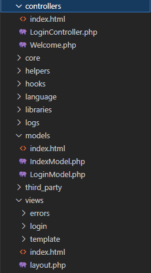

# Reviewing-Codeigniter

## Giới thiệu

CodeIgniter là một framework PHP phổ biến và nhẹ nhàng, được thiết kế để giúp các nhà phát triển xây dựng các ứng dụng web nhanh chóng. Framework này nổi tiếng với hiệu suất cao, cấu trúc linh hoạt và dễ sử dụng.

## Lí do tại sao chọn framework

1. **Hiệu suất cao**:
   - CodeIgniter rất nhanh và nhẹ, giúp các ứng dụng web chạy mượt mà ngay cả khi có lượng truy cập lớn.
     (Với gói tải chỉ có 687 MB)

2. **Dễ dàng cài đặt và sử dụng**:
   - Cấu trúc đơn giản và dễ hiểu, giúp cho việc cài đặt và sử dụng trở nên dễ dàng ngay cả với người mới bắt đầu.
     [Download here](https://codeigniter.com/user_guide/installation/index.html)

3. **Tài liệu phong phú**:
   - CodeIgniter có tài liệu chi tiết và phong phú, hỗ trợ tốt cho các nhà phát triển trong quá trình sử dụng.[Reading here](https://codeigniter.com/user_guide/intro/index.html)

4. **Cộng đồng hỗ trợ mạnh mẽ**:
   - Cộng đồng lớn và nhiệt tình, dễ dàng tìm kiếm sự hỗ trợ và chia sẻ kiến thức.

5. **Cấu trúc MVC rõ ràng**:
   - Áp dụng mô hình MVC (Model-View-Controller) giúp tách biệt rõ ràng giữa logic xử lý, dữ liệu và giao diện.

6. **Thư viện tích hợp sẵn**:
   - Cung cấp nhiều thư viện và helper tích hợp sẵn giúp tiết kiệm thời gian phát triển.

## Nhược điểm

1. **Hạn chế về tính linh hoạt**:
   - So với một số framework khác, CodeIgniter có thể ít linh hoạt hơn trong việc mở rộng và tuỳ chỉnh.

2. **Thiếu một số tính năng hiện đại**:
   - Không có nhiều tính năng hiện đại và phức tạp như một số framework mới hơn như Laravel hay Symfony.

3. **Quản lý gói (package management)**:
   - So với các framework khác thì codeigniter không hỗ trợ composer => qua đó chúng ta phải tự cài đặt thủ công

4. **Bảo mật**:
   - Mặc dù có các tính năng bảo mật cơ bản, nhưng người dùng cần phải cẩn thận và thêm các lớp bảo mật bổ sung khi cần thiết.
---

## Cài đặt

Để cài đặt và chạy CodeIgniter, bạn cần thực hiện các bước sau:

1. **Tải CodeIgniter**: Tải phiên bản mới nhất từ [trang chủ CodeIgniter](https://codeigniter.com/).

2. **Tải Xampp**: Lên trang chủ xampp để tải [Download here](https://www.apachefriends.org/download.html).
   -Sau khi tải xong lưu thư mục trên ổ đĩa

3. **Mở ứng dụng Xampp và nhấn vào exploerer**:Mở thư mục htdocs tạo thư mục codeigniter

4. **Giải nén CodeIgniter vào thư mục codeigniter trong htdocs**: 

5. **Mở visual studio code**: Mở terminal trong visual studio code và gõ lệnh php -S localhost:7000
   - VD: Tại đây sẽ chạy trang với giao diện được thay đổi là Web bán hàng như sau: 

## Thực hành

Thực hành áp dụng Codeigniter:

1. **Xác định mô hình**: Ở bài này áp dụng mô hình 3 lớp MVC
   - .
2. **Trong lớp controller**: Tạo 1 file LoginController.php dùng để xử lý việc nhận thông tin đăng nhập từ người dùng, xác thực thông tin này với cơ sở dữ liệu và tạo phiên làm việc (session) cho người dùng nếu thông tin hợp lệ.
3. **Trong lớp model**: Tạo 1 file LoginView.php dùng để thực hiện việc xác thực thông tin đăng nhập của người dùng, như kiểm tra tên người dùng và mật khẩu có hợp lệ hay không bằng cách so sánh với dữ liệu lưu trữ trong cơ sở dữ liệu.
4. **Trong lớp view**: Tạo 1 thư mục login sau đó tạo file index.php dùng để thiết kế giao diện
5. **Kết nối database với cơ sở dữ liệu Aiven**: Tạo 1 file để kết nối với cơ sở dữ liệu của aiven với tên database.php ![image]
   - Bạn có thể tham khảo kết nối aiven tại [đây](https://aiven.io/platform) 
7.  

## Liên hệ

Đây là bài viết sau khi tìm hiểu. Nếu có ý kiến xin vui lòng gửi về email hotloan124@gmail.com
